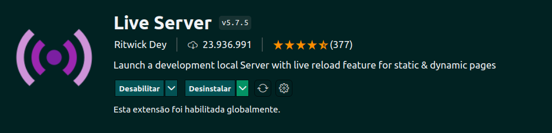

# Lista de Tarefas


> Eu desenvolvi os arquivos `index.html`, `script.js`, `style.css`, `README.md` e as captudas `Alicacao.png`, `live-server`.

* Todos arquivos exeto os citados acima foram desenvolvidos pela [Trybe](https://www.betrybe.com/).

## Contexto

Desenvolvi uma lista de tarefas onde é possivel adicionar, selecionar, marcar como concluido, limpar todas as tarefas ou apenas as marcadas.

## Técnologias usadas

Front-end:
> Desenvolvido usando: CSS3, HTML5, JavaScript

## Instalando Dependências

```bash
npm install
```

## Executando aplicação

* clone o repositório:

  ```bash
  git clone git@github.com:Andreyrvs/todo-list.git
  ```

* Para rodar a aplicação inslale a extensão:



Clique com o botão direito do mouse no arquivo `index.html` da Janela do Explorer e clique em Abrir com o Live Server.

> A aplicação utiliza a resolução **1366 x 768**

## Executando Testes

* Para rodar todos os testes:

  ```bash
    npm test
  ```

* Para rodar o test usando cypress:

   ```bash
     npm run cypress:open
   ```

* Para rodar o linter:

  ```bash
    npm run lint
  ```

* Para rodar o linter de estilo:

  ```bash
    npm run lint:styles
  ```
